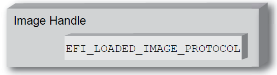
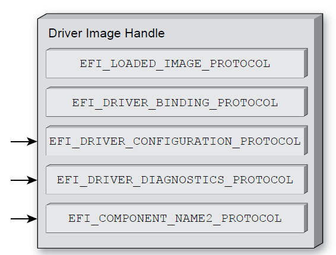
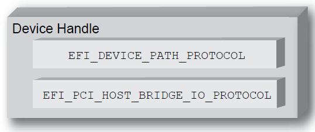
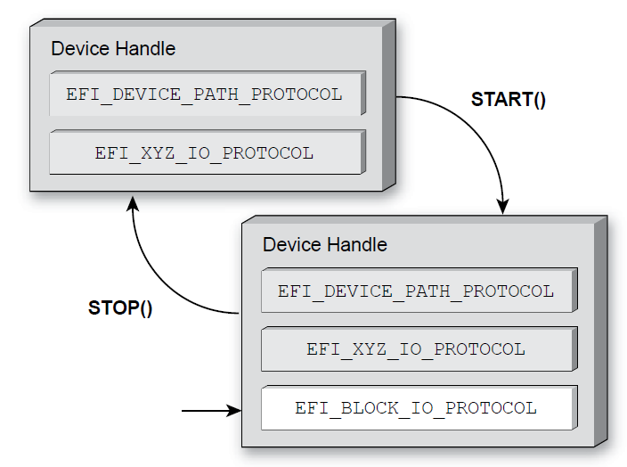

##UEFI Driver Model##

### Driver Initialization ###

- Driver loaded by Boot service `LoadImage()` which loads a 
Portable Executable/Common File Format (PE/COFF) into system memory 
- and drivers must be started with the Boot Service `StartImage()` . A driver that follows the UEFI Driver Model is required to install
an instance of the Driver Binding Protocol onto its own Image Handle.
- A handle that contains a Loaded
Image Protocol instance is called an Image Handle.

- An Image Handle that
contains a Driver Binding Protocol instance is known as a Driver Image Handle

### Driver Binding Protocol ###
The Driver Binding Protocol contains three functions

- Supported() 
	- tests to see if the driver supports a given controller
- Start()
	- is what actually adds the additional I/O protocols to a device handle
- Stop()
	- that forces the driver to stop managing a device handle.
	
The Support(), Start(), and Stop() functions of the UEFI
Driver Binding Protocol are required to make use of the new Boot Service
OpenProtocol() to get a protocol interface and the new Boot Service
CloseProtocol() to release a protocol interface.
### Host Bus Controllers ###

- Drivers are not allowed to touch any hardware in the     driver’s entry point. As a result, drivers are loaded and started, but they are all waiting to be told to
manage one or more controllers in the system.
- The _UEFI Boot Manager_, is responsible for managing the connection of drivers to controllers. This
initial collection of controllers is known as the Host Bus Controllers. 

### Device Handle ###

Each host bridge is represented in UEFI as a device handle that contains
a Device Path Protocol instance, and a protocol instance that abstracts the
I/O operations that the host bus can perform. For example, a PCI Host Bus
Controller supports the PCI Host Bridge I/O Protocol.

### Device Driver ###
- A device driver is not allowed to create any new device handles. Instead, it
installs additional protocol interfaces on an existing device handle.
- The most common type of device driver attaches an I/O abstraction to a device handle
that has been created by a bus driver.

>In
this example, the device handle is a child of the XYZ Bus, so it contains an XYZ
I/O Protocol for the I/O services that the XYZ bus supports. It also contains a
Device Path Protocol that was placed there by the XYZ Bus Driver. The Device
Path Protocol is not required for all device handles.<

### Hint ###
- A bus driver creates device handle and device driver install protocols to a device handle via `Start()`
- Entry point of drivers installs the Driver Binding Protocol onto its image handle

